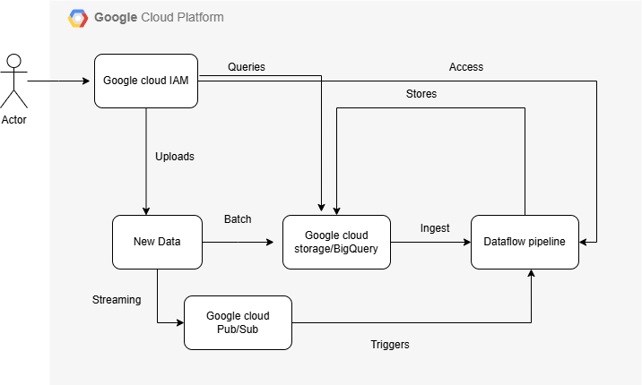

# Restaurant and Car Park Data Analysis 

## Project Overview

This project consists of 2 parts. 

### Restaurant Data Analysis:
The first part extracts restaurant data from Zomato and saves restaurant details and also event details that happened through April 2019. It also analyses the relationship between rating score and rating text threshold.

### Car Park Data Analysis:
The second part is a CLI interface that allows users to query a real time API for carpark information based off carpark number or address.

## Setup Instructions

Follow these steps to set up the project on your local machine:

### Prerequisites

- Python 3.x (>= 3.6 recommended)
- pip (Python package installer)

### Step 1: Clone the repository

```bash
git clone https://github.com/LiuYJ2002/govtech.git
cd .\src
```

### Step 2: Install dependencies

```bash
pip install -r requirements.txt
```

### Step 3: Usage examples (restaurant data)
First we will see how to extract restaurant details
```bash
python main.py
```
Under the `output` folder, 2 files - `restaurant_details.csv` and `restaurant_events.csv` will be created and will contain the following data

### restaurant_details.csv
-	Restaurant Id
-	Restaurant Name
-	Country
-	City
-	User Rating Votes
-	User Aggregate Rating (as float)
-	Cuisines
-	Event Date

### restaurant_events.csv
-	Event Id
-	Restaurant Id
-	Restaurant Name
-	Photo URL
-	Event Title
-	Event Start Date
-	Event End Date

`restaurant_events.csv` only contains data of events that happens through April 2019

Next, we will analyse the relationship between restaurant rating score and rating text threshold. A table will appear in the command line

## Restaurant Rating Summary

This table summarizes the restaurant ratings based on user reviews.

| Rating Text   | Min  | Max  | Mean      | Count |
|--------------|------|------|-----------|-------|
| Average      | 2.5  | 3.4  | 3.193333  | 60    |
| Bardzo dobrze | 4.1  | 4.1  | 4.100000  | 1     |
| Bueno        | 3.9  | 3.9  | 3.900000  | 1     |
| Eccellente   | 4.7  | 4.7  | 4.700000  | 1     |
| Excelente    | 4.5  | 4.9  | 4.700000  | 2     |
| Excellent    | 4.5  | 4.9  | 4.666207  | 435   |
| Good         | 3.5  | 3.9  | 3.776224  | 143   |
| Muito Bom    | 4.4  | 4.4  | 4.400000  | 1     |
| Muy Bueno    | 4.3  | 4.3  | 4.300000  | 2     |
| Not rated    | 0.0  | 0.0  | 0.000000  | 23    |
| Poor         | 2.2  | 2.2  | 2.200000  | 1     |
| Skvělá volba | 3.7  | 3.7  | 3.700000  | 1     |
| Skvělé       | 4.9  | 4.9  | 4.900000  | 1     |
| Terbaik      | 4.7  | 4.8  | 4.750000  | 2     |
| Velmi dobré  | 4.1  | 4.3  | 4.166667  | 3     |
| Very Good    | 4.0  | 4.4  | 4.215891  | 623   |

The findings show that the main categories are `Excellent, Very Good, Good, Average, Poor` due to the high count. The most frequently used rating category is `Very Good` with 623 reviews, followed by `Excellent` with 435 reviews. This suggests that most restaurants received a good rating. The mean of the ratings are given as:

- "Excellent": 4.67
- "Very Good": 4.22
- "Good": 3.78
- "Average": 3.20
- "Poor": 2.2

Thus we can see that in general rating text threshold is better as rating score increases. There could also be a potential issue of diners being biased in giving higher ratings.

### Step 4: Usage examples (carpark data)

#### Query carpark by carpark number
Example usage
```bash
python main.py --carpark_number <carpark_number>
eg. python main.py --carpark_number ACB
```
#### Query carpark by address
Example usage
```bash
python main.py --address <address>
eg. python main.py --address "BLK 270/271 ALBERT CENTRE BASEMENT CAR PARK"
```
The command is also able to search for keywords thus the full address need not be provided

Output:
- **Carpark Number**: Unique identifier for the car park.
- **Address**: Location of the car park.
- **Capacity**: Total number of lots available.
- **Available**: Number of lots currently vacant.
- **Short Term Parking Hours**: Indicates if short-term parking is available and for how long.
- **Free Parking Hours**: Specifies whether free parking is available.
- **Night Parking**: Shows if night parking is allowed.
- **Coordinates**: X and Y coordinates for mapping the car park.
- **Last Updated**: Timestamp of the last update from the real-time system.

### Key design decisions

### Assumptions made

### Future cloud deployment
Using google cloud services, csv files and data could be stored in google cloud storage/Bigquery. Considering in the future, there would be larger volume of data to process unlike simpler tesk implemented in this activity, I decided that google dataflow pipeline can be used for data processing due to its scalability and flexibility of using apache beam to build python data processing pipelines. The output can also be saved to cloud storage. If real time processing is needed, connecting cloud pub/sub to listen for events to trigger the pipeline will be better also.


### System architecture

